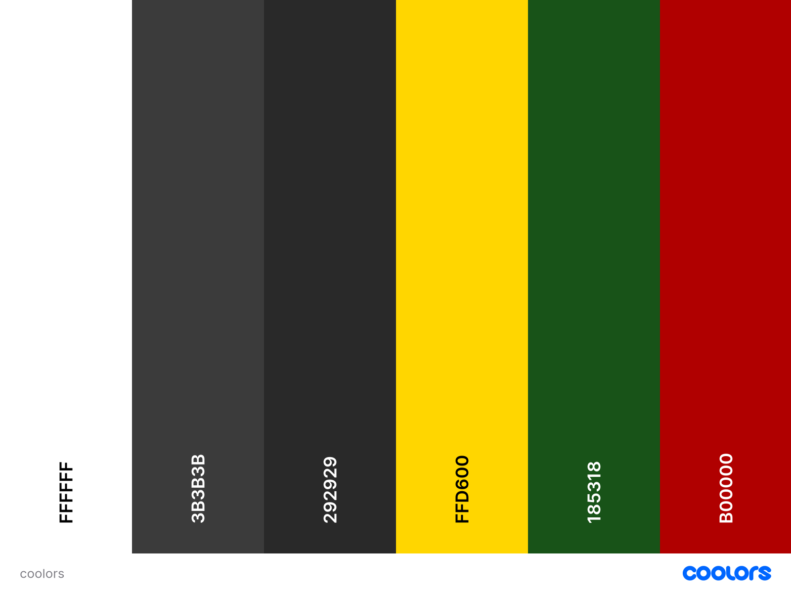
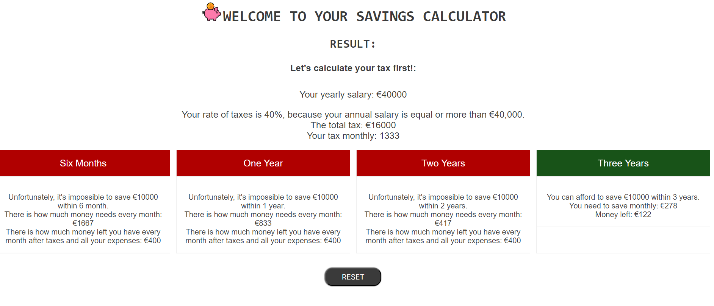
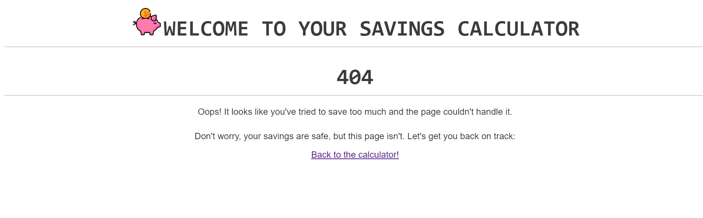

# [SAVINGS CALCULATOR](https://dfedyachkina.github.io/savings-calculator)

source: [amiresponsive](https://ui.dev/amiresponsive?url=https://dfedyachkina.github.io/savings-calculator)

## UX

### Colour Scheme

- `#3b3b3b` used for primary text.
- `#3b3b3b` used for primary highlights.
- `#3b3b3b` and `#ffffff` used for secondary text.
- `#ffffff` and `#3b3b3b`used for secondary highlights.

I used [coolors.co](https://coolors.co/e84610-009fe3-4a4a4f-445261-d63649-e6ecf0-000000) to generate my colour palette.

### Typography

- [Roboto Mono](https://fonts.google.com/specimen/Roboto+Mono) was used for the primary headers and titles.

- [Oswald](https://fonts.google.com/specimen/Oswald) and [Open Sans](https://fonts.google.com/specimen/Open+Sans) were used for all other secondary text.

## Features

### Existing Features

- **Introduction and Start**

    - User Introduction and Calculator Overview: The application begins by welcoming the user and providing a comprehensive explanation of the calculator's functionality. It details the specific financial aspects that the calculator addresses, including savings projections for various time periods (6 months, 1 year, 2 years, and 3 years). Additionally, it highlights the calculator's capability to estimate tax calculations, ensuring users understand the full scope of its utility, particularly for Irish financial planning.
    - Initiate Calculator Usage: The interface includes a prominently displayed button that allows users to initiate the calculator. This intuitive design ensures users can effortlessly begin their financial planning journey by accessing the calculator's features with a single click.

- **Calculator**

    - Input Section for Required Values: The calculator section provides a user-friendly interface for entering the necessary financial data. Users can input their values, such as income, savings goals, and other relevant financial information. This section is designed to be intuitive, ensuring users can effortlessly provide the required inputs to receive accurate and personalized financial calculations.

- **Result**

    - Calculation Result Display: The result section presents the outcomes of the user's calculations in a clear and concise manner. It provides detailed financial projections based on the input values, including savings estimates for specified time periods. Additionally, this section includes error handling, displaying informative messages if there were any issues or inaccuracies in the input data, ensuring users receive reliable and precise results.

- **Footer**

    - The footer containts the name of developer and kink to her social media.

- **404**

    - The page containts the message of 404 error and a link to bak to the calculator. 

### Future Features

- Period Selection Checkboxes
    - An upcoming enhancement will introduce checkboxes within the calculator, enabling users to select specific periods for their savings goals. Users will have the flexibility to choose from predefined time frames, such as 6 months, 1 year, 2 years, and 3 years. This feature will tailor the financial projections to the selected periods, providing a more customized and relevant savings plan based on the user's preferences.

- Calculation of PRSI, PAYE, USC, and Pension Scheme Contributions
    - A planned enhancement will enable the calculator to include detailed computations of PRSI (Pay Related Social Insurance), PAYE (Pay As You Earn), USC (Universal Social Charge), and pension scheme contributions. This feature will allow users to input their specific contribution rates, and the calculator will accurately factor these deductions into the financial projections. By incorporating these elements, the calculator will provide a more comprehensive and precise analysis of the user's financial situation, ensuring all relevant deductions are accounted for in the savings plan.

- Additional Taxable Income Calculation
    - An upcoming enhancement will introduce functionality to account for additional income streams. Users will be able to input details of any extra income, and the calculator will determine its taxability based on current tax regulations. This feature will integrate these additional earnings into the overall financial calculations, ensuring that all taxable income is accurately included. By doing so, the calculator will provide a more thorough and precise financial overview, taking into consideration all sources of income and their respective tax implications.

## Tools & Technologies Used

-  used to generate README and TESTING templates.
-  used for secure online code storage.
-  used as a cloud-based IDE for development.
-  used for the main site content.
-  used for the main site design and layout.
-  used for user interaction on the site.
-  used for hosting the deployed front-end site.
-  used to help debug, troubleshoot, and explain things.
-  used for the icons.

## Testing

> [!NOTE]  
> For all testing, please refer to the [TESTING.md](TESTING.md) file.

## Deployment

The site was deployed to GitHub Pages. The steps to deploy are as follows:

- In the [GitHub repository](https://github.com/dfedyachkina/savings-calculator), navigate to the Settings tab 
- From the source section drop-down menu, select the **Main** Branch, then click "Save".
- The page will be automatically refreshed with a detailed ribbon display to indicate the successful deployment.

The live link can be found [here](https://dfedyachkina.github.io/savings-calculator)

### Local Deployment

This project can be cloned or forked in order to make a local copy on your own system.

#### Cloning

You can clone the repository by following these steps:

1. Go to the [GitHub repository](https://github.com/dfedyachkina/savings-calculator) 
2. Locate the Code button above the list of files and click it 
3. Select if you prefer to clone using HTTPS, SSH, or GitHub CLI and click the copy button to copy the URL to your clipboard
4. Open Git Bash or Terminal
5. Change the current working directory to the one where you want the cloned directory
6. In your IDE Terminal, type the following command to clone my repository:
	- `git clone https://github.com/dfedyachkina/savings-calculator.git`
7. Press Enter to create your local clone.

Alternatively, if using Gitpod, you can click below to create your own workspace using this repository.

Please note that in order to directly open the project in Gitpod, you need to have the browser extension installed.
A tutorial on how to do that can be found [here](https://www.gitpod.io/docs/configure/user-settings/browser-extension).

#### Forking

By forking the GitHub Repository, we make a copy of the original repository on our GitHub account to view and/or make changes without affecting the original owner's repository.
You can fork this repository by using the following steps:

1. Log in to GitHub and locate the [GitHub Repository](https://github.com/dfedyachkina/savings-calculator)
2. At the top of the Repository (not top of page) just above the "Settings" Button on the menu, locate the "Fork" Button.
3. Once clicked, you should now have a copy of the original repository in your own GitHub account!

### Local VS Deployment

## Credits

### Content

| Source | Location | Notes |
| --- | --- | --- |
| [Markdown Builder](https://tim.2bn.dev/markdown-builder) | README and TESTING | tool to help generate the Markdown files |
| [W3Schools](https://www.w3schools.com/howto/tryit.asp?filename=tryhow_css_pricing_table) | CSS and HTML | build up cards |
| [Irish Taxes](https://www.revenue.ie/en/jobs-and-pensions/calculating-your-income-tax/how-income-tax-is-calculated.aspx) | JS| calculate taxes|

### Media

| Source | Location | Type | Notes |
| --- | --- | --- | --- |
| [Flat Icon](https://www.flaticon.com/) | header | image | favicon on all pages |

### Acknowledgements

- I would like to thank my Code Institute mentor, [Tim Nelson](https://github.com/TravelTimN) for his support throughout the development of this project.
