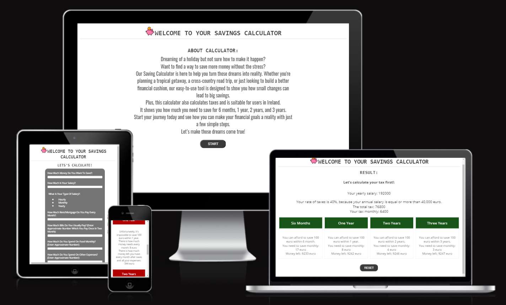

# [SAVINGS CALCULATOR](https://dfedyachkina.github.io/savings-calculator)

source: [amiresponsive](https://ui.dev/amiresponsive?url=https://dfedyachkina.github.io/savings-calculator)

## UX

### Colour Scheme

- `#3b3b3b` used for primary text.
- `#3b3b3b` used for primary highlights.
- `#3b3b3b` and `#ffffff` used for secondary text.
- `#ffffff` and `#3b3b3b`used for secondary highlights.

I used [coolors.co](https://coolors.co/e84610-009fe3-4a4a4f-445261-d63649-e6ecf0-000000) to generate my colour palette.

### Typography

- [Roboto Mono](https://fonts.google.com/specimen/Roboto+Mono) was used for the primary headers and titles.

- [Oswald](https://fonts.google.com/specimen/Oswald) and [Open Sans](https://fonts.google.com/specimen/Open+Sans) were used for all other secondary text.

