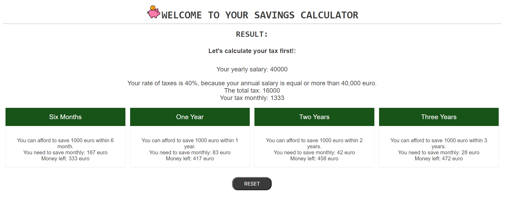

# Testing

> [!NOTE]  
> Return back to the [README.md](README.md) file.

## Code Validation

### HTML

I have used the recommended [HTML W3C Validator](https://validator.w3.org) to validate all of my HTML files.

| Directory | File | Screenshot | Notes |
| --- | --- | --- | --- |
|  | index.html |  | |

### CSS

I have used the recommended [CSS Jigsaw Validator](https://jigsaw.w3.org/css-validator) to validate all of my CSS files.

| Directory | File | Screenshot | Notes |
| --- | --- | --- | --- |
| assets | style.css |  | |

### JavaScript

I have used the recommended [JShint Validator](https://jshint.com) to validate all of my JS files.

| Directory | File | Screenshot | Notes |
| --- | --- | --- | --- |
| assets | script.js |  | |

## Browser Compatibility

I've tested my deployed project on multiple browsers to check for compatibility issues.

| Browser | Introduction| Calculator | Result | Notes |
| --- | --- | --- | --- | --- |
| Chrome |  |  |  | Works as expected |
| Firefox |  |  |  | Works as expected |
| Edge |  |  |  | Works as expected |

## Responsiveness

I've tested my deployed project on multiple devices to check for responsiveness issues.

| Device | Introduction| Calculator | Result | Notes |
| --- | --- | --- | --- | --- |
| Mobile (DevTools) |  |  |  | Works as expected |
| Tablet (DevTools) |  |  |  | Works as expected |
| Desktop |  |  |  | Works as expected |

## Lighthouse Audit

I've tested my deployed project using the Lighthouse Audit tool to check for any major issues.

| Page | Mobile | Desktop | Notes |
| --- | --- | --- | --- |
| Home |  |  | Some minor warnings |

## Defensive Programming

🛑🛑🛑🛑🛑🛑🛑🛑🛑🛑-START OF NOTES (to be deleted)

Defensive programming (defensive design) is extremely important!

When building projects that accept user inputs or forms, you should always test the level of security for each.
Examples of this could include (not limited to):

Forms:
- Users cannot submit an empty form
- Users must enter valid email addresses

PP3 (Python-only):
- Users must enter a valid letter/word/string when prompted
- Users must choose from a specific list only

MS3 (Flask) | MS4/PP4/PP5 (Django):
- Users cannot brute-force a URL to navigate to a restricted page
- Users cannot perform CRUD functionality while logged-out
- User-A should not be able to manipulate data belonging to User-B, or vice versa
- Non-Authenticated users should not be able to access pages that require authentication
- Standard users should not be able to access pages intended for superusers

You'll want to test all functionality on your application, whether it's a standard form,
or uses CRUD functionality for data manipulation on a database.
Make sure to include the `required` attribute on any form-fields that should be mandatory.
Try to access various pages on your site as different user types (User-A, User-B, guest user, admin, superuser).

You should include any manual tests performed, and the expected results/outcome.

Testing should be replicable.
Ideally, tests cases should focus on each individual section of every page on the website.
Each test case should be specific, objective, and step-wise replicable.

Instead of adding a general overview saying that everything works fine,
consider documenting tests on each element of the page
(ie. button clicks, input box validation, navigation links, etc.) by testing them in their happy flow,
and also the bad/exception flow, mentioning the expected and observed results,
and drawing a parallel between them where applicable.

Consider using the following format for manual test cases:

Expected Outcome / Test Performed / Result Received / Fixes Implemented

- **Expected**: "Feature is expected to do X when the user does Y."
- **Testing**: "Tested the feature by doing Y."
- (either) **Result**: "The feature behaved as expected, and it did Y."
- (or) **Result**: "The feature did not respond to A, B, or C."
- **Fix**: "I did Z to the code because something was missing."

Use the table below as a basic start, and expand on it using the logic above.

🛑🛑🛑🛑🛑🛑🛑🛑🛑🛑-END OF NOTES (to be deleted)

Defensive programming was manually tested with the below user acceptance testing:

| Page | Expectation | Test | Result | Fix | Screenshot |
| --- | --- | --- | --- | --- | --- |
| Introduction| | | | | |
| | Feature is expected to do give introduction of the calculator and allows him to start to calculate when the user does beginning to use this calculator | Tested the feature by doing clicking on "Start" button | The feature behaved as expected, and it did it starts the calculator | Test concluded and passed |  |
| Calculator | | | | | |
| | Feature is expected to do check if inputted data when the user does inputting data | Tested the feature by doing input data and click on "Calculate!" button | The feature behaved as expected, and it did not allow the user procceed with empty or incorrect inputs | Test concluded and passed |  |
| | Feature is expected to do give a calculator form and give the result when the user does inputting data | Tested the feature by doing input data and click on "Calculate!" button | The feature behaved as expected, and it did calculation and give the result | Test concluded and passed |  |
| Result | | | | | |
| | Feature is expected to do show the result and allow to the user reload a page when the user does click on "Reset" button  | Tested the feature by doing checking the result and clicking on "Reset" button | The feature behaved as expected, and it did shows correct result and reload page by clicking on "Reset" button | Test concluded and passed |  |

| Page | User Action | Expected Result | Pass/Fail | Comments |
| --- | --- | --- | --- | --- |
| Introductipn | | | | |
| | Click on Start button | Hide the intro and show a calculator | Pass | |
| Calculator | | | | |
| | Enter disered saving | Field will accept a number which equal or more than 100 | Pass | |
| | Enter salary | Field will accept a number which equal or more than 10 | Pass | |
| | Choose type of salary| User required to click on one of those radio buttons | Pass | |
| | Enter rent/mortgage| Field will accept a number which equal or more than 0  | Pass | |
| | Enter bills | Field will accept a number which equal or more than 0  | Pass | |
| | Enter food expenses | Field will accept a number which equal or more than 0  | Pass | |
| | Enter other expenses | Field will accept a number which equal or more than 0  | Pass | |
| | Click on Calculate button | Doesn't procced until user will input all correct data | Pass | |
| | Click on calculate button| Hide calculator and show the result | Pass | |
| Result| | | | |
| | Clcik on Reset button | Reload window | Pass | |

## Bugs

-  typeOfSalary didn’t get an attribute of checked radiobutton

    

    - To fix this, I change the attribute by which querySelector looking for checked button.

    - Before: 
    function findCheckedRadioButton() {
    let selectedRadioButton = document.querySelector('input[name="radio"]:checked');
    if (selectedRadioButton) {
        return selectedRadioButton.getAttribute("data-type");
    } else {
        return null;
    }
}
    - After:
    function findCheckedRadioButton() {
    let selectedRadioButton = document.querySelector('input[type="radio"]:checked');
    if (selectedRadioButton) {
        return selectedRadioButton.getAttribute("data-type");
    } else {
        return null;
    }
    }

- Functions letsCalculate, hourlySlary, monthlySalary don’t get value of vars

    

    - To fix this, I add keys such as salary, desiredSavings, rentMortgage, bills, food, otherExpenses into the functions.

    function letsCalculate(desiredSavings, salary, rentMortgage, bills, food, otherExpenses) {
    let typeOfSalary = findCheckedRadioButton();
    if (typeOfSalary === "hourly") {
        console.log(salary);
        salary = hourlySalary(salary);
    } else if (typeOfSalary === "monthly") {
        salary = monthlySalary(salary);
    } else if (typeOfSalary === null) {
        alert(`You haven't clicked on the radio button! Please choose your type of salary`);
        throw `Radio button hasn't been clicked`;
    }
}

- Function sixMonth, oneYear, twoYears and threeYears don't get a value of the variable taxMonthly

    

    - To fix this, I add return message and variable of taxMontly separetly in taxCalculator function and assign this value to the var taxMonthly in letsCalculate function.

- JS cannot find the element with ID result.

    

    - To fix this, I added an element with ID result in HTML file.

- JS doesn't give process with minimum variables.

    

    - To fix this, I change a logical signs instead of "<=" to "<".

- The result cards are different sizes

    

    - To fix this, I add displaY: flex style and flex-direction: column  to the columns class.

- JS doesn't check validation of inputted data

    

    - To fix this, I add code into the DOM contecnt loader.

    form.addEventListener("submit", function(event) {

        event.preventDefault();

        if (this.checkValidity()) {
            // form is valid
            checkData();
        } else {
            // form is not valid
            this.reportValidity();
        }
    });

## Unfixed Bugs

🛑🛑🛑🛑🛑🛑🛑🛑🛑🛑-START OF NOTES (to be deleted)

You will need to mention unfixed bugs and why they were not fixed.
This section should include shortcomings of the frameworks or technologies used.
Although time can be a big variable to consider, paucity of time and difficulty understanding
implementation is not a valid reason to leave bugs unfixed.

If you've identified any unfixed bugs, no matter how small, be sure to list them here.
It's better to be honest and list them, because if it's not documented and an assessor finds the issue,
they need to know whether or not you're aware of them as well, and why you've not corrected/fixed them.

Some examples:

🛑🛑🛑🛑🛑🛑🛑🛑🛑🛑-END OF NOTES (to be deleted)

- On devices smaller than 375px, the page starts to have `overflow-x` scrolling.

    

    - Attempted fix: I tried to add additional media queries to handle this, but things started becoming too small to read.

- For PP3, when using a helper `clear()` function, any text above the height of the terminal does not clear, and remains when you scroll up.

    

    - Attempted fix: I tried to adjust the terminal size, but it only resizes the actual terminal, not the allowable area for text.

- When validating HTML with a semantic `section` element, the validator warns about lacking a header `h2-h6`. This is acceptable.

    

    - Attempted fix: this is a known warning and acceptable, and my section doesn't require a header since it's dynamically added via JS.

🛑🛑🛑🛑🛑🛑🛑🛑🛑🛑-START OF NOTES (to be deleted)

If you legitimately cannot find any unfixed bugs or warnings, then use the following sentence:

🛑🛑🛑🛑🛑🛑🛑🛑🛑🛑-END OF NOTES (to be deleted)

> [!NOTE]  
> There are no remaining bugs that I am aware of.
