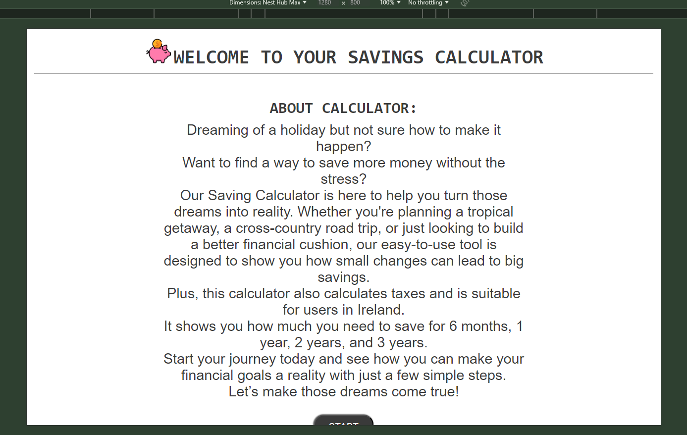

# Testing

> [!NOTE]  
> Return back to the [README.md](README.md) file.

## Code Validation

### HTML

I have used the recommended [HTML W3C Validator](https://validator.w3.org) to validate all of my HTML files.

| Directory | File | Screenshot | Notes |
| --- | --- | --- | --- |
|  | index.html |  | |
|  | 404.html |  | |

### CSS

I have used the recommended [CSS Jigsaw Validator](https://jigsaw.w3.org/css-validator) to validate all of my CSS files.

| Directory | File | Screenshot | Notes |
| --- | --- | --- | --- |
| assets | style.css |  | |

### JavaScript

I have used the recommended [JShint Validator](https://jshint.com) to validate all of my JS files.

| Directory | File | Screenshot | Notes |
| --- | --- | --- | --- |
| assets | script.js |  | |

## Browser Compatibility

I've tested my deployed project on multiple browsers to check for compatibility issues.

| Browser | Introduction| Calculator | Result | 404 | Notes |
| --- | --- | --- | --- | --- | --- |
| Chrome |  |  |  | | Works as expected |
| Firefox |  |  |  | | Works as expected |
| Edge |  |  |  | | Works as expected |

## Responsiveness

I've tested my deployed project on multiple devices to check for responsiveness issues.

| Device | Introduction| Calculator | Result | Notes |
| --- | --- | --- | --- | --- |
| Mobile (DevTools) |  |  |  | Works as expected |
| Tablet (DevTools) |  |  |  | Works as expected |
| Desktop |  |  |  | Works as expected |

## Lighthouse Audit

I've tested my deployed project using the Lighthouse Audit tool to check for any major issues.

| Page | Mobile | Desktop | Notes |
| --- | --- | --- | --- |
| Home |  |  | Some minor warnings |

## Defensive Programming

Defensive programming was manually tested with the below user acceptance testing:

| Page | Expectation | Test | Result | Fix | Screenshot |
| --- | --- | --- | --- | --- | --- |
| Introduction| | | | | |
| | Feature is expected to do give introduction of the calculator and allows him to start to calculate when the user does beginning to use this calculator | Tested the feature by doing clicking on "Start" button | The feature behaved as expected, and it did it starts the calculator | Test concluded and passed |  |
| Calculator | | | | | |
| | Feature is expected to do check if inputted data when the user does inputting data | Tested the feature by doing input data and click on "Calculate!" button | The feature behaved as expected, and it did not allow the user procceed with empty or incorrect inputs | Test concluded and passed |  |
| | Feature is expected to do give a calculator form and give the result when the user does inputting data | Tested the feature by doing input data and click on "Calculate!" button | The feature behaved as expected, and it did calculation and give the result | Test concluded and passed |  |
| Result | | | | | |
| | Feature is expected to do show the result and allow to the user reload a page when the user does click on "Reset" button  | Tested the feature by doing checking the result and clicking on "Reset" button | The feature behaved as expected, and it did shows correct result and reload page by clicking on "Reset" button | Test concluded and passed |  |

| Page | User Action | Expected Result | Pass/Fail | Comments |
| --- | --- | --- | --- | --- |
| Introductipn | | | | |
| | Click on Start button | Hide the intro and show a calculator | Pass | |
| Calculator | | | | |
| | Enter disered saving | Field will accept a number which equal or more than 100 | Pass | |
| | Enter salary | Field will accept a number which equal or more than 10 | Pass | |
| | Choose type of salary| User required to click on one of those radio buttons | Pass | |
| | Enter rent/mortgage| Field will accept a number which equal or more than 0  | Pass | |
| | Enter bills | Field will accept a number which equal or more than 0  | Pass | |
| | Enter food expenses | Field will accept a number which equal or more than 0  | Pass | |
| | Enter other expenses | Field will accept a number which equal or more than 0  | Pass | |
| | Click on Calculate button | Doesn't procced until user will input all correct data | Pass | |
| | Click on calculate button| Hide calculator and show the result | Pass | |
| Result| | | | |
| | Clcik on Reset button | Reload window | Pass | |

## Bugs

-  typeOfSalary didn’t get an attribute of checked radiobutton

    

    - To fix this, I change the attribute by which querySelector looking for checked button.

    - Before: 
    function findCheckedRadioButton() {
    let selectedRadioButton = document.querySelector('input[name="radio"]:checked');
    if (selectedRadioButton) {
        return selectedRadioButton.getAttribute("data-type");
    } else {
        return null;
    }
}
    - After:
    function findCheckedRadioButton() {
    let selectedRadioButton = document.querySelector('input[type="radio"]:checked');
    if (selectedRadioButton) {
        return selectedRadioButton.getAttribute("data-type");
    } else {
        return null;
    }
    }

- Functions letsCalculate, hourlySlary, monthlySalary don’t get value of vars

    

    - To fix this, I add keys such as salary, desiredSavings, rentMortgage, bills, food, otherExpenses into the functions.
function letsCalculate(desiredSavings, salary, rentMortgage, bills, food, otherExpenses) {
    let typeOfSalary = findCheckedRadioButton();
    if (typeOfSalary === "hourly") {
        resultText.innerText = `Your hourly salary ${salary} euro has been converted to yearly salary.`;
        salary = hourlySalary(salary);
    } else if (typeOfSalary === "monthly") {
        resultText.innerText = `Your monthly salary ${salary} euro has been converted to yearly salary.`;
        salary = monthlySalary(salary);
    } else if (typeOfSalary === null) {
        resultText.classList.remove("hide");
        calculateTaxHeading.classList.add("hide");
    
        resultText.innerText = "You haven't checked a radio button - please click on RESET and try again";
        resultText.style.color = "red";
        document.getElementById("yearly-salary").classList.add("hide");
        document.getElementById("tax").classList.add("hide");
        return;
    }
    document.getElementById("yearly-salary").innerText = `Your yearly salary: ${salary}`;
    let taxInfo = taxCalculator(salary);
    document.getElementById("tax").innerText = taxInfo.message;
    let taxMonthly = taxInfo.taxMonthly;
    document.getElementById("six-month").innerText = sixMonthSave(desiredSavings, salary, rentMortgage, bills, food, otherExpenses, taxMonthly);
    document.getElementById("one-year").innerText = oneYearSave(desiredSavings, salary, rentMortgage, bills, food, otherExpenses, taxMonthly);
    document.getElementById("two-years").innerText = twoYearsSave(desiredSavings, salary, rentMortgage, bills, food, otherExpenses, taxMonthly);
    document.getElementById("three-years").innerText = threeYearsSave(desiredSavings, salary, rentMortgage, bills, food, otherExpenses, taxMonthly);
}

- Function sixMonth, oneYear, twoYears and threeYears don't get a value of the variable taxMonthly

    

    - To fix this, I add return message and variable of taxMontly separetly in taxCalculator function and assign this value to the var taxMonthly in letsCalculate function.

- JS cannot find the element with ID result.

    

    - To fix this, I added an element with ID result in HTML file.

- JS doesn't give process with minimum variables.

    

    - To fix this, I change a logical signs instead of "<=" to "<".

- The result cards are different sizes

    

    - To fix this, I add displaY: flex style and flex-direction: column  to the columns class.

- JS doesn't check validation of inputted data

    

    - To fix this, I add code into the DOM contecnt loader.

    form.addEventListener("submit", function(event) {

        event.preventDefault();

        if (this.checkValidity()) {
            // form is valid
            checkData();
        } else {
            // form is not valid
            this.reportValidity();
        }
    });

## Unfixed Bugs

> [!NOTE]  
> There are no remaining bugs that I am aware of.
